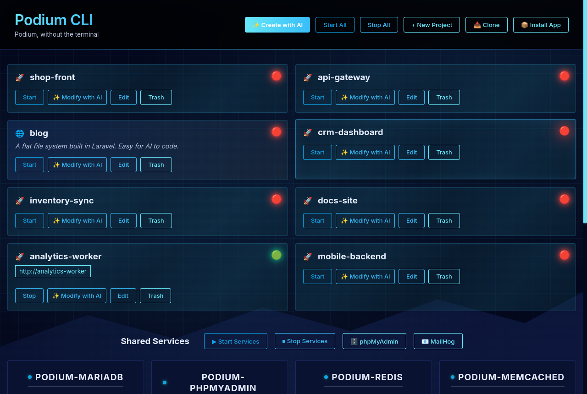

# Podium GUI

## Podium, without the terminal

**Describe what you want to build, pick from what it suggests, and watch it go — plus a live view of every project and service on the machine.**

A desktop front end for [Podium CLI](https://github.com/CaneBayComputers/podium-cli). The CLI does the work; the GUI makes it visible and clickable. Same projects, same shared services, same URLs — you can switch between the two freely.



<sub>Shown in the **Podium** theme, one of five. Project names are samples.</sub>

---

## What it does

- **Create with AI** — describe a project in plain English. Podium works out the stack, shows you the candidates with a reason for each, and lets you choose the app or framework, the database and the name before anything is created.
- **Install an app** — browse and search the 100+ app library, install with a name. The database comes fixed by the installer, so there is nothing to get wrong.
- **New project** — scaffold any supported framework with a database of your choosing.
- **Clone** — pull an existing repo into a Podium project, work directly or fork it.
- **Modify with AI** — every project tile can reopen its AI session where you left off, in an embedded terminal.
- **Services at a glance** — start, stop and flush the shared services; live status for every project.
- **Embedded terminals, tabbed** — AI sessions run in real terminals inside the window. Several at once, each in its own tab; hiding the window leaves them running.
- **AI agent setup** — choose between Claude, Codex, Gemini and Aider from the app. Podium installs the one you pick if it is not already on the machine.
- **Live output** — creates and installs stream their CLI output as they run, and a failure keeps that output on screen instead of hiding it.
- **Five themes** — Retro, Dark, Light, Matrix and Podium, under **Settings → Appearance**, applied immediately including to open terminals.

Projects get PHP 8.3, Python 3 or Node 22 containers with nginx, supervisor and the database drivers already compiled in, and a real hostname instead of a port number.

---

## Install

**Linux**

```bash
git clone https://github.com/CaneBayComputers/podium-gui.git
cd podium-gui
./install-ubuntu.sh          # or install-fedora.sh / install-arch.sh
```

**macOS**

```bash
git clone https://github.com/CaneBayComputers/podium-gui.git
cd podium-gui
./install-mac.sh
```

**Windows**

Open PowerShell **as Administrator** and paste:

```powershell
irm https://raw.githubusercontent.com/CaneBayComputers/podium-gui/master/scripts/install-windows.ps1 | iex
```

Every installer sets up from source, so the checkout you install from is the one that runs. Updating is a `git pull`, and re-running an installer is safe.

---

## Where Podium runs

Podium itself is Docker plus shell scripts, so where it can run differs by platform — and that is the one thing worth understanding before you start.

**Linux and macOS** — the installer puts Podium CLI on the same machine if it is not already there. The GUI is a front end for the CLI and is useless without it, so it is never installed alone. Projects live locally; on first launch the GUI collects what `podium configure` needs and runs it for you.

**Windows** — there is no local Podium, and the installer does not try to add one. The GUI runs on Windows and drives Podium on *other* machines over SSH: a Linux box, a Mac, a Raspberry Pi, an EC2 instance. Add them under **Settings → SSH Hosts**, and each one needs Podium already installed and configured. Projects, containers and files all live on the host that runs them.

Remote hosts work from Linux and macOS too — a Windows machine simply has no local option to fall back on.

---

## License

MIT — see [LICENSE](LICENSE). Same as [Podium CLI](https://github.com/CaneBayComputers/podium-cli). Free to use, modify and distribute.

## Support

- 📧 canebaycomputers@gmail.com
- 🐛 [Issues](https://github.com/CaneBayComputers/podium-gui/issues)
- 📖 [Podium documentation](https://podiumcli.com/guide/)

---

© 2024 Cane Bay Computers. Released under the MIT License.
